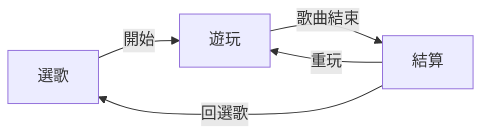

# Phase 1 — 選歌 → 遊玩 → 結算

> **前置：** 先完成 [STEP1.md](STEP1.md)（1 歌 · Tap · 純 osu · 判定）。  
> 本文件 = **Phase 1 Step 2**，在 Step 1 閉環上疊功能。

## 玩家流程



| 步驟 | 做什麼 | 對應文件 |
|------|--------|----------|
| 選歌 | 本地列表、選難度、BPM / totalNotes | 精簡 [04-room/spec.md](screens/04-room/spec.md) |
| 遊玩 | 4K 向上、Tap+Hold、即時分數/combo | [05-game-arena/spec.md](screens/05-game-arena/spec.md) |
| 結算 | P/C/B/M、總分、重玩/回選歌 | [result-screen.md](screens/05-game-arena/result-screen.md) |

---

## Step 1 → Step 2 增量

| 項目 | Step 1 已有 | Step 2 新增 |
|------|-------------|-------------|
| 譜面 | 1 首硬編、純 `.osu` | 1～3 首、**osu → Canonical Chart** |
| 音符 | Tap | + Hold（[頭端合併](architecture/scoring-hybrid.md#hold-長條判定)） |
| UI | 單場景 | 選歌 + 結算 |
| 計分 | 無 | [scoring-hybrid](architecture/scoring-hybrid.md) 1e8 |
| 模式 | — | 自由 + 向上 |

---

## 必做範圍

| 項目 | 規格 |
|------|------|
| 譜面 | `.osu` mania 4K → Canonical Chart；1～3 首 |
| 音訊 | 隨譜面資料夾 |
| 模式 | 自由 + 向上 |
| 判定 | P / C / B / Miss |
| 操作 | ↑↓←→ |
| UI | 預設 skin；2D 音符 + 靜態背景 |
| 平台 | Unity 單機 |

---

## 明確不做

- 登入 / 大廳 / 房間 / FishNet / Steam / PlayFab
- SM / GN import
- 普通模式、向下/傾斜
- VMD、自訂 skin、replay、G 幣
- Classic exe（仍只 Enhanced 單機）

---

## 成功標準（Done）

- [ ] Step 1 Done 清單全勾
- [ ] 選歌 ≥1 首、≥1 難度；顯示 totalNotes
- [ ] Hold 可打；P+C+B+M = totalNotes
- [ ] 結算顯示 **歌名 + 難度**
- [ ] 結算 0～100,000,000；重玩 / 回選歌

---

## 程式切塊（Step 2 增量）

```
src/
├── Remake.Osu/              # Step 1 已有
├── Remake.Chart/            # + osu → Canonical Chart
├── Remake.Ruleset/          # + Hold、hybrid score
└── Remake.Unity.Enhanced/
    └── Assets/Scripts/
        ├── Step1/             # 保留
        ├── Phase1SongSelect.cs
        ├── Phase1Gameplay.cs
        └── Phase1Result.cs

StreamingAssets/Songs/{id}/
```

---

## 階段 ladder

| 步驟 | 範圍 |
|------|------|
| **[STEP1](STEP1.md)** | 1 歌 · Tap · 純 osu · 判定 |
| **Phase 1**（本文件） | + 選歌 · Hold · 計分 · 結算 |
| [MVP](MVP.md) | + 登入 → 大廳 → 多人 |
| [PROJECT](PROJECT.md) | + Classic exe · Steam · VMD… |

## 相關

- [architecture/chart-format.md](architecture/chart-format.md)
- [architecture/scoring-hybrid.md](architecture/scoring-hybrid.md)
- [architecture/repo-structure.md](architecture/repo-structure.md)
