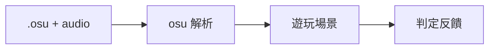

# Step 1 — 一首歌 · 打判定 · 純 osu

> **現在就做這一步。**  
> 比 [PHASE1.md](PHASE1.md) 更小：驗證 **osu 譜 → 音符 → 按鍵 → 判定** 閉環。

## 目標

Play 進 Unity → **固定一首** mania 4K `.osu` → 聽歌 → 按鍵 → 看到 **Perfect / Cool / Bad / Miss**。



**沒有** 選歌、結算、計分公式、Canonical Chart、Classic exe。

---

## 必做

| 項目 | 規格 |
|------|------|
| 譜面 | **1 首**，硬編路徑或 Inspector 指定；**只讀 `.osu`** |
| 格式 | osu! **mania 4K**（`Mode: 3`，`Keys: 4`） |
| 音符 | **Tap only**（Step 1 不做 Hold） |
| 音訊 | `.osu` 同目錄 `AudioFilename`（`.ogg` / `.mp3`） |
| Scroll | 向上、固定速度（osu `SliderMultiplier` + 簡化 timing） |
| 操作 | ↑↓←→ |
| 判定 | P / C / B / Miss；窗口可先 osu 預設比例 |
| UI | 4 軌 + 判定線 + 判定字；**無選單** |
| 執行 | Unity **單場景** Play |

---

## 明確不做

| 不做 | 留給 |
|------|------|
| 選歌 / 結算畫面 | [PHASE1.md](PHASE1.md) Step 2 |
| Hold | PHASE1 Step 2 |
| Canonical Chart、SM/GN import | PHASE1 Step 2+ |
| hybrid 1e8 計分、combo 封頂 | PHASE1 Step 2 |
| 自由/普通模式、scroll 方向 | PHASE1 |
| Classic exe、FishNet、Steam | MVP |

---

## 成功標準（Done）

- [ ] `StreamingAssets/Step1/` 放 **1 組** `chart.osu` + 音檔，Play 即開
- [ ] 音符按 osu 時間轴出现、向上 scroll
- [ ] 四鍵按下 → 對應 lane 出判定字（P/C/B/M）
- [ ] Miss（漏打 / 早晚過多）有反馈
- [ ] 整首播完場景結束或停住（不必結算頁）

---

## 譜面目錄

```
StreamingAssets/Step1/
├── demo.osu          # mania 4K，僅 Tap
└── demo.ogg          # AudioFilename 指向此檔
```

`.osu` 自己用 osu! 編輯器做或從現成 4K 譜挑一首短的。**Step 1 不寫 import 工具。**

---

## 程式切塊（最小）

```
src/
├── Remake.Osu/                    # Step 1 只做 osu 解析
│   ├── OsuBeatmap.cs              # 直接映射 osu 欄位
│   ├── OsuHitObject.cs            # mania note
│   └── OsuBeatmapParser.cs        # 讀 .osu 文本
├── Remake.Ruleset/
│   ├── JudgmentWindows.cs
│   ├── ManiaJudgmentEngine.cs     # Tap 判定 only
│   └── GameplayClock.cs           # 跟音訊時間
└── Remake.Unity.Enhanced/
    └── Assets/
        ├── Scenes/Step1.unity       # 唯一場景
        └── Scripts/Step1/
            ├── Step1Bootstrap.cs    # 載入固定 .osu
            ├── Step1NoteRenderer.cs # 4 軌 scroll
            └── Step1Input.cs        # 方向鍵 → engine
```

**Step 1 不建** `Remake.Classic`、`Remake.Replay`、Server。

解析器 **直接產 osu 結構**，不經 [chart-format.md](architecture/chart-format.md) Canonical；PHASE1 Step 2 再加 `osu → Chart` adapter。

---

## 判定（Step 1 簡化）

| 判定 | 条件（示意，ms） |
|------|------------------|
| Perfect | \|Δt\| ≤ 16 |
| Cool | ≤ 64 |
| Bad | ≤ 100 |
| Miss | 漏打或 > 100 |

窗口 execute 時對 osu mania 預設；Step 1 **不實作计分**，只顯示判定。

---

## 與後續

| 步驟 | 範圍 | 文件 |
|------|------|------|
| **Step 1** | 1 歌 · Tap · 純 osu · 判定 | 本文件 |
| **Phase 1 Step 2** | 選歌 → Hold → hybrid 計分 → 結算 | [PHASE1.md](PHASE1.md) |
| **MVP** | 登入 → 大廳 → 多人 | [MVP.md](MVP.md) |

## 相關

- [architecture/dual-variant.md](architecture/dual-variant.md) — Step 1 只出 Enhanced 薄殼
- [reference/sm-yhaniki-notes.md](reference/sm-yhaniki-notes.md) — Step 1 不讀 SM
