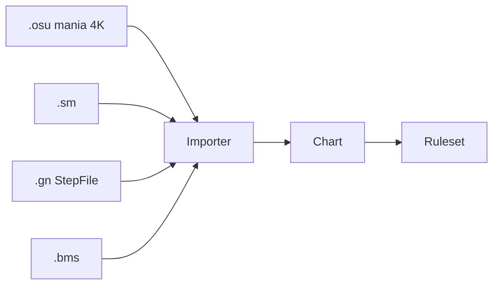

# Canonical Chart 格式

> Runtime 唯一譜面格式。SM / osu / GN / BMS 皆 import 為 Chart。  
> **[Step 1](../STEP1.md) 跳過本格式**，直接讀 `.osu`。

**設計原則**

- **判定軸**：一律 `TimeMs` + osu `TimingPoints`（BPM / SV）— 與 [scroll-timing.md](scroll-timing.md) 相同
- **視覺軸**：拍色、拍線、流速、逆流、停拍、**多段擊打** — **不改** hit window 語意（每段仍有獨立 `TimeMs`）
- **基底**：osu mania；缺省行為與 osu 一致；進階欄位可空，import 舊譜不受影響

---

## Schema（概念）

```csharp
Chart {
  Meta: ChartMeta
  Scroll: GlobalScroll           // 預設方向 + SliderMultiplier
  TimingPoints: TimingPoint[]    // BPM + SV（osu）
  Display: DisplayLayer          // 視覺專用；見下節
  Difficulties: DifficultySlot[]
}

ChartMeta {
  Title, Artist, Creator
  AudioPath                     // 相對 StreamingAssets
  AudioOffsetMs
}

GlobalScroll {
  Direction: Up | Down | Tilt    // 全譜預設；可被 ScrollSection 覆蓋
  SliderMultiplier: number       // osu [General]
}

TimingPoint {                    // osu 同款；詳見 scroll-timing.md
  TimeMs: number
  Bpm: number | null
  SliderVelocity: number | null
  Meter: number | null          // 拍號；供拍色推導
}

DisplayLayer {
  BeatColorScheme: BeatColorScheme | null
  BeatAttributes: BeatAttributeEvent[]
  MeasureLines: MeasureLineEvent[]
  ScrollSections: ScrollSectionEvent[]
}

NoteEvent {
  TimeMs: number                  // 單擊 Kind 的判定時刻；MultiHit 見 Passes[]
  Lane: 0 | 1 | 2 | 3            // 4K mania
  Kind: Tap | HoldHead | HoldBody | HoldRelease | MultiHitTap
  HoldId: string | null
  Weight: number                  // 1e8 預算用
  MultiHit: MultiHitSpec | null    // Kind=MultiHitTap 必填
  // --- 視覺擴充（可空）---
  ColorIndex: 0..3 | null
  ScrollMultiplier: number | null
  ScrollStop: boolean
}

MultiHitSpec {
  GroupId: string                 // 渲染器：同一顆 note 精靈
  Passes: MultiHitPass[]          // 有序；至少 2 段
}

MultiHitPass {
  TimeMs: number                  // 該段判定時刻
  Approach: Forward | Backward    // 該段接近方向（覆寫全局 ScrollSection）
}

DifficultySlot {
  Name: string
  Level: number
  Events: NoteEvent[]
}
```

> **時間 / BPM / SV** 詳見 [scroll-timing.md](scroll-timing.md)。GN / SM 小節制 import 時轉 `TimeMs` + `TimingPoints`。

---

## 視覺擴充（六項）

### 1. 拍色 — SM `#BEATATTRIBUTES` 語意

依**小節內第幾拍**決定 note 顏色（1 拍紅、2 藍、3 黃、4 綠…），不靠 lane。

```csharp
BeatColorScheme {
  Default: ColorIndex[4]         // 未覆寫時：meter 內 beat 0..3 → 色
}

BeatAttributeEvent {
  TimeMs: number                  // 該小節起點（或任意拍點）
  Colors: ColorIndex[4] | null    // 覆寫此小節四拍配色；null = 用 Default
  Skip: boolean                   // SM Skip；該拍不顯示色塊（Hold body 仍連續）
}
```

| 行為 | 說明 |
|------|------|
| 自動 | `ColorIndex == null` 且無 `BeatAttribute` → 由 `TimingPoint.Meter` + note 在小節內 beat 推 `0..3` |
| 強制 | `NoteEvent.ColorIndex` 優先（作譜器手動上色） |
| 小節覆寫 | 該 `TimeMs` 起至下一 `BeatAttribute` 前，用 `Colors[]` |
| Skin | 色 index 映射到 [skin-system.md](skin-system.md) tap/hold 圖；Classic 可對 GN 箭頭色 |

**Import**

| 來源 | 映射 |
|------|------|
| `.sm` `#BEATATTRIBUTES` | `BeatAttributeEvent` |
| `.gn` StepFrame slot / 箭頭色 | `ColorIndex` 或 `BeatAttribute` |
| `.osu` | 無；全用 `BeatColorScheme.Default`（或 editor 後處理） |

---

### 2. 拍線重置 — BMS `#BAR` 語意

顯示用小節線位置可**脫離**純 BPM 整除；可重置「第幾小節」數字。

```csharp
MeasureLineEvent {
  TimeMs: number
  DisplayMeasure: number | null  // 顯示用的小節序；null = 遞增不重置
  Style: Normal | Strong         // 強拍線 / 弱拍線
  Hidden: boolean                 // 隱藏自動 BPM 拍線，只留手動
}
```

| 行為 | 說明 |
|------|------|
| 預設 | 無 `MeasureLines` → 依 `TimingPoint` BPM + `Meter` 自動畫拍線 |
| BMS `#BAR` | 每個 BAR 變一筆 `MeasureLineEvent`；`DisplayMeasure` 對應小節號重置 |
| GN type 9 | import 為 `MeasureLineEvent`（measurement 奇數位） |
| 編輯 | Enhanced 作譜器可拖拍線；底層仍存 `TimeMs` |

判定與 `TimeMs` **不受**拍線影響；僅 UI / 作譜網格對齊。

---

### 3. 單 note 流速 — 太鼓達人語意

**單顆** note 的接近速度倍率；判定時刻不變（有別於 timeline SV 整段生效）。

```csharp
// NoteEvent 欄位
ScrollMultiplier: number | null   // 預設 null → 視為 1.0
```

```text
noteApproachPxPerMs = globalScroll(timeMs)
                    × activeSvMultiplier(timeMs)
                    × note.ScrollMultiplier   // 僅此 note；Hold 全段共用 head 的值
```

| 對照 | 差異 |
|------|------|
| osu SV 綠線 | 整段時間軸倍率 |
| 太鼓 roll / 气球 | 單 note `ScrollMultiplier`；可 2×、0.5× 混在同一 SV 段 |
| `ScrollMultiplier = 0` | 單 note 停拍；見 §5 |
| Hold | head 的 `ScrollMultiplier` 套用到 body + release 視覺 |

**Import**：太鼓系 / GN 特殊段 → 填 `ScrollMultiplier`；純 osu 譜留 `null`。

---

### 4. 區段逆流 — CHUNITHM / SM-YHANIKI 語意

指定時間區間內 scroll **方向或符號**反轉；可與全局 `Scroll.Direction` 不同。

```csharp
ScrollSectionEvent {
  StartMs: number
  EndMs: number | null            // null = 直到下一 Section 或曲終
  Mode: Reverse | MirrorSpeed | Stop
  SpeedMultiplier: number         // Reverse / MirrorSpeed 用；Stop 時忽略
}
```

| Mode | 效果 |
|------|------|
| `Reverse` | 音符從反方向進判定線（SM `note(RV)` / scroll Down）；**速度仍正** |
| `MirrorSpeed` | `SpeedMultiplier < 0` → 視覺上 notes **往反時間流**（CHUNITHM gimmick） |
| `Stop` | **整段停拍**；見 §5 |

Classic：可只實作 `Reverse`（YHANIKI 逆流皮）；`MirrorSpeed` / `Stop` Enhanced 專用。

---

### 5. 停拍 — CHUNITHM STOP / 太鼓單 note 定住

音樂與 **判定 `TimeMs` 照常走**；只有 scroll 視覺凍結或單顆 note 定住。

#### 整段停

```csharp
ScrollSectionEvent {
  StartMs, EndMs,
  Mode: Stop
}
```

| 行為 | 說明 |
|------|------|
| 進入 `StartMs` | 畫面上所有 note **凍結當前像素位置** |
| 停拍期間 | `audioClock`、hit window、DPS 動畫 **不暫停** |
| 離開 `EndMs` | 從凍結位置 **恢復 scroll**；不補償、不瞬移判定線 |
| 重疊 | 同時間多段 `Stop` 取最外層；`Stop` 優先於 `Reverse` / `MirrorSpeed` |

**Import**：osu `SV=0` 綠線段 → `Mode: Stop`（比當純 SV 語意更準）；BMS / CHUNITHM 停軸段 → 同上。

#### 單 note 停

```csharp
NoteEvent {
  ScrollStop: true                 // 或 ScrollMultiplier: 0（二寫一等）
}
```

| 行為 | 說明 |
|------|------|
| 作用域 | **僅此 note**（Hold 全段跟 head）；其他 note 照常 scroll |
| 凍結時機 | note **進入可視範圍後**定住，直到 `TimeMs` 前恢復接近判定線 |
| 與整段停 | 整段 `Stop` 進行中 → 全部凍結；單 note `ScrollStop` 不額外生效 |
| 與流速 | `ScrollStop=true` 時忽略 `ScrollMultiplier`；停拍結束後若仍有多餘 approach 時間可恢復原倍率 |

```text
noteFrozen(note, t) =
  inStopSection(t)
  OR (note.ScrollStop OR note.ScrollMultiplier == 0)
     AND noteInApproach(note, t)
     AND NOT inStopSection(t)   // 整段停已涵蓋
```

#### 流速合成（含停拍）

```text
if inStopSection(t):     pixelDelta = 0          // 整段停
elif noteFrozen(note,t): pixelDelta = 0          // 單 note 停
else:
  pixelDelta = baseScroll × svMult × sectionMult × noteMult
```

Hold：head 的 `ScrollStop` / `ScrollMultiplier` 套用到 body + release。

---

### 6. 多段擊打（順／逆流往返）— CHUNITHM WORLD'S END

**一顆 note、多次判定、段間換接近方向**。打完上一段不消失，反向 scroll 再打來一次。

參考：[WORLD'S END 戻](https://silentblue.remywiki.com/CHUNITHM:WORLD'S_END)（`戻` = 逆流）；**B.B.K.K.B.K.K. 戻** 主要靠整段 `Stop` + `Reverse` 重複 pattern（見下「兩種做法」）；**閃鋼のブリューナク 戻** / **bubble attack 覚** / **猫祭り 嘘** 才有「打中後 note 彈回再打」。

#### Schema 範例（順 → 逆 → 順，打三次）

```csharp
NoteEvent {
  Kind: MultiHitTap
  Lane: 1
  TimeMs: 51300                    // = 最後一段 TimeMs（排序 / 預覽用）
  MultiHit: {
    GroupId: "bbkk-bounce-1"
    Passes: [
      { TimeMs: 51000, Approach: Forward  },   // 順流打第 1 次
      { TimeMs: 51150, Approach: Backward },   // 逆流打第 2 次
      { TimeMs: 51300, Approach: Forward  },   // 再順流打第 3 次
    ]
  }
  Weight: 3                         // 或均分 1e8；見 scoring
}
```

#### Runtime 行為

| 階段 | 行為 |
|------|------|
| Pass i 接近 | 僅該 note 用 `Passes[i].Approach`（`Forward`=全局方向；`Backward`=該 note 逆流） |
| Pass i 擊中 | 播放 hit 特效；**不 despawn**；切到 Pass i+1 |
| Pass i Miss | 該段記 Miss；**仍繼續** Pass i+1（CHUNITHM 感；可調 Strict 模式） |
| 最後一段 | 擊中或 Miss 後 note 消失 |

```text
noteApproachDir(note, passIndex) =
  Passes[passIndex].Approach == Backward
    ? flip(globalScrollDirection)
    : globalScrollDirection

// 仍吃 SV、ScrollMultiplier；整段 Stop 時全凍結（§5）
```

#### 兩種做法對照（BBKKBKK 戻 @ ~51s）

| 譜面現象 | 做法 | 現有 schema |
|----------|------|-------------|
| **整段 scroll 反向**，pattern 鏡像重複；看著像同一顆來回 | `ScrollSectionEvent { Mode: Reverse }` + `Stop` | §4 + §5 已夠 |
| **同一顆 sprite** 順流擊中 → 彈回 → 逆流擊中 → 再順流 | `Kind: MultiHitTap` + `Passes[]` | §6 |
| 4K mania 簡化 | 也可拆成 **3 個 Tap** 同 Lane、不同 `TimeMs` + 段間 `Reverse` | 不用 MultiHit，但視覺是三顆 note |

> [B.B.K.K.B.K.K. 戻](https://silentblue.remywiki.com/CHUNITHM:WORLD'S_END) wiki：**與 EXPERT 同 chart，加 stop / reverse**；reverse 段 pattern 重複，**看眼前打即可** — 多數段落用 **整段逆流** 即可，不必 MultiHit。  
> 你要的「一顆 note 打三次」→ 用 **MultiHitTap**（Brünak / bubble attack 類譜）。

#### totalNotes / 計分

```text
MultiHitTap 貢獻 totalNotes = len(Passes)   // 3 段 = 3 槽
Perfect + Cool + Bad + Miss == totalNotes   // 每段獨立判定
```

`Weight` 預設均分至各 Pass；見 [scoring-hybrid.md](scoring-hybrid.md)。

#### Import / 階段

| 來源 | 映射 |
|------|------|
| CHUNITHM 官方 | post-MVP 專用 importer；bounced 行 → `MultiHitTap` |
| 手搓 Enhanced | 作譜器 MultiHit 工具 |
| `.osu` | 無；可降級為多個 Tap + SV / Reverse 段 |

**Enhanced+** 定義 schema；**post-MVP** 渲染 + Ruleset 多段判定。

---

## totalNotes

```text
totalNotes = Tap + HoldHead + HoldRelease
           + sum(len(MultiHit.Passes) for MultiHitTap)   // 每 Pass = 1 槽
```

對齊 [SM-YHANIKI](https://github.com/Yhaniki/SM-YHANIKI)「總按鍵數」；結算 `P+C+B+M == totalNotes`。  
`DisplayLayer` 事件**不計入** totalNotes。

---

## Import 流程



| 來源 | Phase | 工具 | Display 映射 |
|------|-------|------|--------------|
| `.osu` mania 4K | **Phase 1** | `Remake.Chart` / `tools/converters/osu_to_chart` | TimingPoints + SV；`SV=0` → `Stop`；拍色 Default |
| `.sm` | MVP+ | `tools/converters/sm_to_chart` | BEATATTRIBUTES、拍線 |
| `.gn` | MVP+ | `tools/converters/gn_to_chart` | type 9 拍線、箭頭色、特殊流速 |
| `.bms` | post-MVP | `tools/converters/bms_to_chart` | `#BAR` → MeasureLineEvent |

### osu mania 映射

| osu | Chart |
|-----|-------|
| `HitObject` circle | Tap |
| `Hold` start | HoldHead |
| `Hold` end | HoldRelease |
| 4 columns | Lane 0–3 |
| `TimingPoints` uninherited | `TimingPoint` BPM |
| `TimingPoints` inherited (SV) | `TimingPoint.SliderVelocity` |
| `SV = 0` timing point | `ScrollSectionEvent { Mode: Stop }` |
| — | `ScrollStop` / 其他 Display 留空 |

---

## 匯出（可選）

| 工具 | 說明 |
|------|------|
| `chart_to_osu` | 分享、測試；停拍可降級為 `SV=0`；拍色 / 單 note 停 / 逆流可能丟失 |
| `chart_to_sm` | post-MVP；BEATATTRIBUTES + 拍線 |

---

## 實作階段

| 階段 | Chart 範圍 |
|------|------------|
| **Step 1** | 跳過；直接 `.osu` |
| **Phase 1** | `Meta` + `TimingPoints` + `NoteEvent`；固定向上 scroll |
| **MVP** | + `BeatColorScheme.Default`、GN/SM import、`ScrollSection.Reverse` |
| **Enhanced+** | + 單 note 流速 / 停拍、`MeasureLineEvent`、整段 `Stop`、BMS import、`MirrorSpeed` |
| **post-MVP** | + `MultiHitTap` 渲染與多段判定、CHUNITHM bounce import |
| **Classic** | GN 拍色 + 逆流皮；無 `MirrorSpeed` |

---

## 相關

- [scroll-timing.md](scroll-timing.md) — BPM / SV / 流速合成
- [skin-system.md](skin-system.md) — 拍色 → 圖素
- [scoring-hybrid.md](scoring-hybrid.md)
- [repo-structure.md](repo-structure.md)
- [SM_GN_NOTE_FORMAT.md](../reverse-engineering/SM_GN_NOTE_FORMAT.md)
