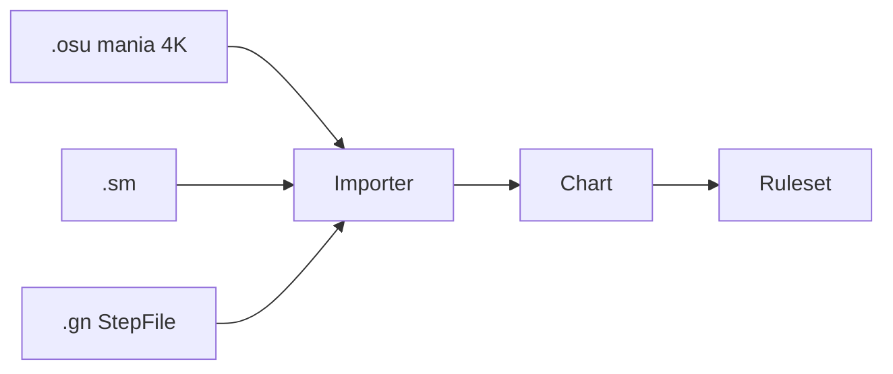

# Canonical Chart 格式

> Runtime 唯一譜面格式。SM / osu / GN 皆 import 為 Chart。  
> **[Step 1](../STEP1.md) 跳過本格式**，直接讀 `.osu`。

## Schema（概念）

```csharp
Chart {
  Meta: {
    Title, Artist, Creator
    Bpm, OffsetMs
    AudioPath          // 相對 StreamingAssets
    Difficulties[]     // Easy / Normal / Hard slots
  }
  Scroll: Up | Down | Tilt
  Events: NoteEvent[]
}

NoteEvent {
  TimeMs: number
  Lane: 0 | 1 | 2 | 3      // 4K mania
  Kind: Tap | HoldHead | HoldBody | HoldRelease
  HoldId: string | null     // Hold 成對用
  Weight: number            // 1e8 預算用，可均等
}

DifficultySlot {
  Name: string
  Level: number
  Events: NoteEvent[]       // 或引用 chart 內子集
}
```

> **時間 / BPM / SV** 詳見 [scroll-timing.md](scroll-timing.md)。原版 GN 小節制 import 時轉 `TimeMs` + `TimingPoints`。

## totalNotes

```text
totalNotes = Tap + HoldHead + HoldRelease   // 每 Hold = 2 槽
```

對齊 [SM-YHANIKI](https://github.com/Yhaniki/SM-YHANIKI)「總按鍵數」；結算 `P+C+B+M == totalNotes`。

## Import 流程



| 來源 | Phase | 工具 |
|------|-------|------|
| `.osu` mania 4K | **Phase 1** | `Remake.Chart` / `tools/converters/osu_to_chart` |
| `.sm` | MVP+ | `tools/converters/sm_to_chart` |
| `.gn` | MVP+ | 見 [SM_GN_NOTE_FORMAT.md](../reverse-engineering/SM_GN_NOTE_FORMAT.md) |

### osu mania 映射

| osu | Chart |
|-----|-------|
| `HitObject` circle | Tap |
| `Hold` start | HoldHead |
| `Hold` end | HoldRelease |
| 4 columns | Lane 0–3 |

## 匯出（可選）

`tools/converters/chart_to_osu` — 分享、測試用。

## Phase 1

- 只實作 **osu → Chart**
- 歌曲目錄：`StreamingAssets/Songs/{id}/`（`chart.osu` + `audio.ogg`）

## 相關

- [scroll-timing.md](scroll-timing.md)
- [scoring-hybrid.md](scoring-hybrid.md)
- [repo-structure.md](repo-structure.md)
