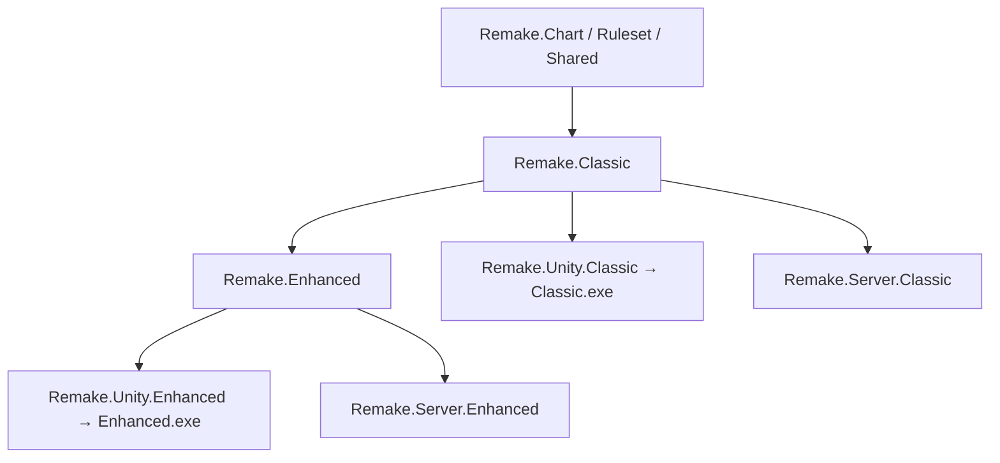

# 雙變體架構（Classic + Enhanced）

> **Classic（原版向）**：行為、UI、計分盡量貼近 SDO 原版  
> **Enhanced（改良版）**：現代化體驗；**依附 Classic 共用函式庫**，只覆寫/擴充差異層

**已決：編譯成兩個獨立程式**，不是同一 client 裡切換、不是同房混用。

| 產物 | 說明 |
|------|------|
| **Classic 版 exe** | 只含 Classic 組裝；連 Classic 伺服器 / 大廳 |
| **Enhanced 版 exe** | Classic 函式庫 + Enhanced 擴充；連 Enhanced 伺服器 / 大廳 |

同一 repo、共用 `Remake.Chart` / `Remake.Ruleset` 等 **DLL**，兩個 Unity **薄殼專案** 各自出包。

---

## 依賴關係



**規則**

- 共用邏輯放 **Core / Ruleset / Classic**；Enhanced **不複製**
- 差異用 **interface + 各版 Composition Root** 綁定，不在共用碼寫 `if (enhanced)`
- Classic exe **不引用** `Remake.Enhanced`、`Remake.Replay`
- Enhanced exe **引用** Classic + Enhanced；Enhanced 缺省可 fallback Classic 實作

---

## 連線與房間

| 項目 | 決策 |
|------|------|
| 變體選擇 | **安裝哪個 exe 就是哪個版**；遊戲內不選 Classic/Enhanced |
| 同房混版 | **否** — Classic 房只接受 Classic client；Enhanced 同理 |
| 伺服器 | MVP 起 **兩套 server 行程**（或不同 port / Steam AppId）；DTO 可共用 `Remake.Shared` |
| 大廳列表 | Classic 大廳只列 Classic 房；Enhanced 大廳只列 Enhanced 房 |

玩家若要兩種體驗 → **裝兩個程式**（或兩個 Steam 子 App，post-MVP 再定）。

---

## 分層職責

| 層 | 放什麼 | 範例 |
|----|--------|------|
| **Core** | 與變體無關 | Chart、hash、音訊 clock、輸入 bitmask |
| **Ruleset** | 一局判定流程（兩版相同部分） | Tap/Hold session、Hold 頭端合併（若原版亦同） |
| **Classic** | 原版向 | SDO 計分、原版 UI、GN/DPS、原版 scroll 考據 |
| **Enhanced** | 改良差異 | hybrid 1e8、本地 replay、osu skin、現代 UX |
| **Unity 薄殼** | 場景、Prefab、DI 根 | `Remake.Unity.Classic` / `.Enhanced` 各一 |

---

## Classic vs Enhanced 對照

| 項目 | Classic exe | Enhanced exe |
|------|-------------|--------------|
| **目標** | 懷舊、考據、GN 譜原生感 | 日常遊玩、現代 UX |
| **計分** | SDO 原版 | [scoring-hybrid.md](scoring-hybrid.md) |
| **UI** | 貼 [原版 wireframe](../screens/05-game-arena/result-screen.md) | 可現代化借鑑 |
| **譜面** | GN / StepFile 優先 | Canonical + osu/SM import |
| **Skin** | GN NoteSkin | osu / SM-YHANIKI |
| **自由模式 best** | 不記 | [replay-local.md](../systems/replay-local.md) |
| **FishNet** | Classic server | Enhanced server |

**共用 DLL（不拆兩份）**

- Tap/Hold 模型、4K 輸入
- 房間狀態機（waiting → in_game → result）
- FishNet DTO 定義（server 依變體分支行為）

---

## 程式組織

```
src/
├── Remake.Chart/
├── Remake.Ruleset/
├── Remake.Classic/
├── Remake.Enhanced/          # Enhanced exe 才引用
├── Remake.Replay/            # Enhanced exe 才引用
├── Remake.Shared/
├── Remake.Skin/
├── Remake.Dance/
├── Remake.Platform/
├── Remake.Server.Classic/      # MVP+
├── Remake.Server.Enhanced/     # MVP+
├── Remake.Unity.Classic/       # → Classic 客户端
│   └── Assets/Scripts/Composition/ClassicRoot.cs
└── Remake.Unity.Enhanced/      # → Enhanced 客户端
    └── Assets/Scripts/Composition/EnhancedRoot.cs
```

共用 C# 可抽 **UPM local package** 或 **symlink 到同一 Scripts/Core**，避免複製 Asset。

### 擴充點（各 exe 的 Composition Root 綁定）

| 介面 | Classic exe | Enhanced exe |
|------|-------------|--------------|
| `IScoreCalculator` | `SdoScoreCalculator` | `HybridScoreCalculator` |
| `IResultPresenter` | `ClassicResultScreen` | `EnhancedResultScreen` |
| `IReplayService` | （不編入） | `LocalReplayService` |
| `IChartLoader` | `GnChartLoader` | `CanonicalChartLoader` |
| `ISkinProvider` | `GnNoteSkinProvider` | `OsuSmSkinProvider` |

### Build

| 指令（示意） | 產物 |
|-------------|------|
| `build-classic-client` | `RemakeClassic.exe` |
| `build-enhanced-client` | `RemakeEnhanced.exe` |
| `build-classic-server` | headless Classic |
| `build-enhanced-server` | headless Enhanced |

CI 四條 pipeline；Phase 1 可先只出 **Enhanced** 單機，Classic 薄殼後補。

---

## 文件怎麼標

| 標籤 | 意思 |
|------|------|
| **共用** | 兩 exe 同一行為 |
| **Classic** | 僅 Classic exe |
| **Enhanced** | 僅 Enhanced exe |

screen spec「原版 Reference / 改版 Change」→ **Classic / Enhanced**。

---

## 階段建議

| 階段 | 建議 |
|------|------|
| **Phase 1** | 先 **Step 1** Enhanced 單場景；Step 2 三屏 |
| **MVP** | Classic + Enhanced **各一 client + 各一 server** |
| **全案** | Classic 驗 GN 譜；Enhanced 日常主線 |

---

## 已決 / 待填

- [x] 變體 = **兩個獨立程式**，非同房選、非混連
- [ ] Classic / Enhanced **Steam AppId** 是否分開
- [ ] 兩 Unity 專案 vs 單專案雙 Build Profile（實作時 pin）

## 相關

- [repo-structure.md](repo-structure.md)
- [scoring-hybrid.md](scoring-hybrid.md)
- [PROJECT.md](../PROJECT.md)
