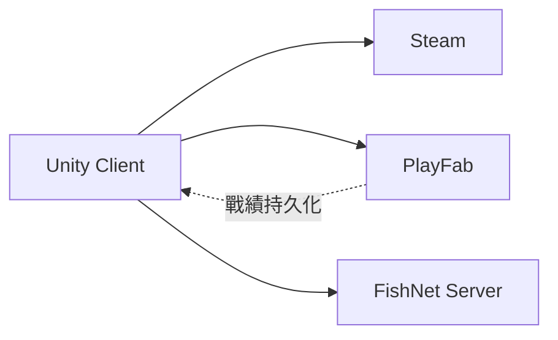

# Online 服務職責

> Phase 1 無連線。MVP 起用。

## 分工

| 服務 | 職責 |
|------|------|
| **Steam**（Facepunch Steamworks） | 發行、Steam 登入、overlay、成就、**Cloud 設定同步（可選）** |
| **PlayFab** | 帳號綁定、Normal 戰績/勝負、leaderboard、雲端 skin 設定 |
| **FishNet** | 房間、準備、開局、輸入同步、結算廣播 |

## 登入

- **Steam 登入為主**
- PlayFab `CustomId` = Steam ID
- 見 [01-login/spec.md](../screens/01-login/spec.md)

## 開局前（FishNet）

- 比對 `Chart.totalNotes` + hash（對齊 SM-YHANIKI 連線驗證）
- 見 [room-matchmaking.md](../systems/room-matchmaking.md)

## 缺檔傳送（post-MVP）

- SM `/share` 概念 → Steam P2P 或 PlayFab CDN

## Steam Cloud — 設定同步

> 詳細欄位：[game-settings.md § 設定儲存與同步](../systems/game-settings.md#設定儲存與同步)

| 項目 | 決策 |
|------|------|
| 權威 | **本地先寫**；使用者勾選的項目才上傳 Steam |
| API | Facepunch `SteamRemoteStorage` |
| 帳號 | 綁 Steam ID；未登入 Steam 時同步選項灰掉 |
| 與 PlayFab | **設定走 Steam Cloud**；戰績/skin 仍 PlayFab（不混） |
| 衝突 | `updatedAt` 較新者覆蓋；平局本地贏 |

PlayFab 不存 client 設定（避免雙云衝突）。

## Phase 1

無 Steam / PlayFab / FishNet。

## 相關

- [networking.md](../systems/networking.md)
- [account-auth.md](../systems/account-auth.md)
