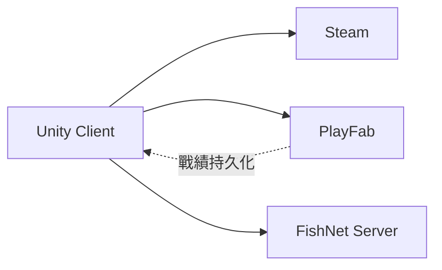

# Online 服務職責

> Phase 1 無連線。MVP 起用。

## 分工

| 服務 | 職責 |
|------|------|
| **Steam**（Facepunch Steamworks） | 發行、Steam 登入、overlay、成就 |
| **PlayFab** | 帳號綁定、Normal 戰績/勝負、leaderboard、雲端 skin 設定 |
| **FishNet** | 房間、準備、開局、輸入同步、結算廣播 |

## 登入

- **Steam 登入為主**
- PlayFab `CustomId` = Steam ID
- 見 [01-login/spec.md](../screens/01-login/spec.md)

## 開局前（FishNet）

- 比對 `Chart.totalNotes` + hash（對齊 SM-YHANIKI 連線驗證）
- 見 [room-matchmaking.md](../systems/room-matchmaking.md)

## 缺檔傳送（post-MVP）

- SM `/share` 概念 → Steam P2P 或 PlayFab CDN

## Phase 1

無 Steam / PlayFab / FishNet。

## 相關

- [networking.md](../systems/networking.md)
- [account-auth.md](../systems/account-auth.md)
