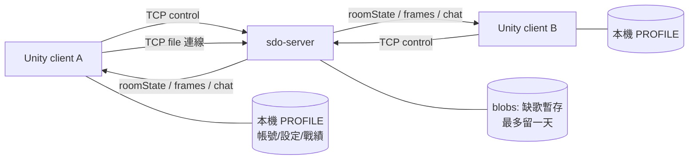

# Online 服務職責

> **這份文件在 2026-07 被整份重寫。** 舊版的分工是 Steam(發行/登入/Cloud)+ PlayFab(帳號/戰績/
> leaderboard)+ FishNet(房間同步)。**三個都沒有採用。** 實際做出來的是一台自己寫的
> standalone C# server,零外部服務、零帳號平台。舊版那張 mermaid 圖與 Steam Cloud 設定同步的
> 表格描述的東西完全不存在,所以整份換掉。

## 分工(現況)

| 元件 | 職責 |
|---|---|
| **`sdo-server`**(自己寫,net8.0,單一執行檔) | 房號配發、座位配置、房主、房間狀態機、訊息轉發、分數流彙整、缺歌檔案暫存 |
| **本機檔案** | 帳號(`PROFILE/<id>/profile.json`)、設定(`PROFILE/config.ini`)、戰績、收藏夾 |
| **無** | Steam、PlayFab、任何雲端服務、任何帳號平台 |

```mermaid
flowchart LR
  A[Unity client A] -->|TCP control| S[sdo-server]
  A -->|TCP file 連線| S
  B[Unity client B] -->|TCP control| S
  S -->|roomState / frames / chat| A
  S -->|roomState / frames / chat| B
  S --- D[(blobs: 缺歌暫存<br/>最多留一天)]
  A --- PA[(本機 PROFILE<br/>帳號/設定/戰績)]
  B --- PB[(本機 PROFILE)]
```

## 為什麼是「自己寫一台」而不是接平台

這是重製一個**已經關服**的遊戲,玩家是「自己和幾個朋友」。從這個前提出發:

- **綁 Steam / PlayFab 等於把「開一台自己的 server 給朋友連」變不可能。** 而那正是唯一的使用情境。
- 需要持久化的東西(角色外觀、戰績、設定)**本來就都在本機**。離線單機模式一直是完整可玩的,
  加連線沒有理由把資料搬到雲端 —— 那只會讓「離線也能玩」變成一句空話。
- server 要保管的其實只有**房間**,而房間是暫時的:開房→打歌→散。它連資料庫都不需要
  (歌曲暫存是檔案,而且最多留一天)。

代價講清楚:**預設沒有跨機器的身分**。`playerId` 是 client 自稱的,server 不驗 ——
那是 LAN / 信任的朋友之間的模式,也是預設值。

要開公網,server 端有四個參數要給(token 認證、TLS、來源限制、上傳配額),
給了就換成「身分由 server 決定 + 全程加密」:

| 開關 | 沒給(預設) | 給了 |
|---|---|---|
| `--tokens <file>` | `hello.playerId` 說了算 | server 用 token 查出你是誰,client 自稱的被忽略 |
| `--tls-cert <pfx>` | 明文 TCP | TLS 1.2/1.3;自簽憑證靠 client 釘選指紋 |
| `--allow-from` / `--max-per-ip` | 誰都能連、連幾條都行 | 握手前就擋 |
| `--upload-mb-hour` | 只有 TTL 與總容量上限 | 每人每小時的上傳量也有上限 |

四道防線共同的性質是**沒生效時什麼異狀都沒有**,所以 server 每次開機都會把現在的模式印出來
(`⚠️` 開頭的每一行 = 一個缺口)。完整設定步驟見 [server/README.md](../../server/README.md) 的公網化一節。

## 帳號

- **沒有登入。** 開機選男/女就是選一個本機 profile(`PROFILE/00000000` = 女、`00000001` = 男)。
- 連線時 `hello` 帶 `playerId`(= profile id)、名字、性別、等級、家族。server 只是照著顯示。
- 同一台機器要開兩份 client 測試時,兩邊必須各指一份 DATA(`SDO_DATA_ROOT`)——
  `config.ini` 是**全域一份**,不隔開的話兩邊會共用 `activeId` 並互相 `Save()` 覆蓋,
  變成同一個角色。

## 開局前的譜面驗證

舊版寫「比對 `Chart.totalNotes` + hash」。實際做法更強:

- 官方歌用 `gn`(全球唯一且穩定)。
- 外部歌(osu/SM)用 **`packId`** = 歌曲資料夾過濾後的內容指紋
  (每個譜面檔算完整 SHA-256,音檔只進檔名+長度 —— 見 [net-song-transfer.md](../systems/net-song-transfer.md))。
  **不能用外部歌的 `gn`**:那是絕對路徑的 hash,換台電腦完全不同。

每個人自己回報「我有沒有這一份」(`setAvailability`),沒有的人自動下載。
`avail != have` 的人按不了準備、也不會被納入這一場。

## 設定同步

**不同步。** 設定寫本機 `config.ini`,而且**刻意**如此:速度、note 皮、掉落方向是個人偏好,
官方也是各自設定(房間只同步房主定的東西:歌、場景、模式、隊形)。

## 相關

- [../systems/networking.md](../systems/networking.md) —— 傳輸層、執行緒模型、診斷
- [../systems/net-protocol.md](../systems/net-protocol.md) —— 訊息集合與房間規則
- [../systems/net-song-transfer.md](../systems/net-song-transfer.md) —— 缺歌傳檔
- [../systems/account-auth.md](../systems/account-auth.md)
