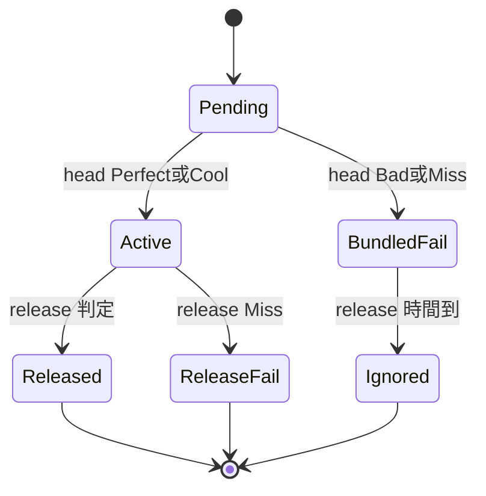

# 混合計分（Scoring Hybrid）

> **Enhanced 專用**；Classic 用 SDO 原版公式 — [dual-variant.md](dual-variant.md)  
> osu 1e8 封頂 + SDO combo + Hold 頭端合併。  
> 原版考據：[SDO_SCORE_FORMULA.md](../reverse-engineering/SDO_SCORE_FORMULA.md)

## 原則

1. **封頂 100,000,000** — 全 Perfect + 滿 combo 時總和 = 1e8
2. **Combo 加成** — 每事件 × `(combo + 1) / 2`（SDO）
3. **Hold release = 1 combo** — head 命中 +1；release 命中再 +1
4. **Hold 頭端合併** — Bad/Miss head 時 release 不另判；note 總數仍對帳

---

## 判定倍率（SDO）

| 判定 | judgeMul | Combo |
|------|----------|-------|
| Perfect | 2.0 | 延續 |
| Cool | 1.5 | **中斷** |
| Bad | 1.0 | 延續（單獨 head 時） |
| Miss | 0.0 | **中斷** |

### 時間窗（SDO 反編譯 tick，Unity 實作換算 ms）

| 誤差 e | 判定 |
|--------|------|
| e ≤ 6 | Perfect |
| 7 ≤ e ≤ 15 | Bad |
| 16 ≤ e ≤ 20 | Cool |
| 21 ≤ e ≤ 25 | Miss |
| e > 25 | Miss |

> 練習模式窗口更窄，見 SDO_SCORE_FORMULA §1.1

---

## Note 對帳

```text
totalNotes = taps + holdHeads + holdReleases
Perfect + Cool + Bad + Miss == totalNotes
```

---

## Hold 長條判定

### 狀態



### 記帳規則

| Head 結果 | Head 時刻（同一批次） | Release 再判？ | Combo 中斷 |
|-----------|----------------------|----------------|------------|
| Perfect | +1 Perfect | ✅ | 依 release |
| Cool | +1 Cool | ✅ | head 1 次 + release 另計 |
| Bad | **+1 Bad +1 Miss(release)** | ❌ | **1 次** |
| Miss | **+1 Miss +1 Miss(release)** | ❌ | **1 次** |

合併批次：

1. 同一窗口依序寫入兩筆 judgment
2. 分數：`baseValue × judgeMul × (combo+1)/2` 各算各槽
3. Combo 用合併前 combo；批次結束 **最多斷 1 次**
4. Head Bad 時 release 槽固定 **Miss**

---

## 公式

### 載入譜面

```
events = taps + holdHeads + holdReleases
totalNotes = len(events)
baseValue[i] = 1e8 * weight[i] / sum(weight)
```

### 單事件得分

```
eventScore = baseValue[i] * judgeMul[judge] * (combo + 1) / 2
totalScore += eventScore
```

### Head 判定（pseudo）

```
onHoldHead(holdId, hit):
  if hit == Miss:
    applyBatch([(Miss, headBase), (Miss, releaseBase)])
    comboBreakOnce()
    markReleaseSkipped(holdId)
  else if hit == Bad:
    applyBatch([(Bad, headBase), (Miss, releaseBase)])
    comboBreakOnce()
    markReleaseSkipped(holdId)
  else:
    applyScore(hit, headBase)

onHoldRelease(holdId, hit):
  if isReleaseSkipped(holdId): return
  applyScore(hit, releaseBase)

assert perfect + cool + bad + miss == totalNotes
```

### SDO 原版對照

| 項目 | SDO 原版 | 本專案 hybrid |
|------|----------|---------------|
| 單顆公式 | `LevelG × LevelScore × JudgeMul × (combo+1)/2` | `baseValue × JudgeMul × (combo+1)/2` |
| 總分尺度 | 無固定封頂 | **1e8 封頂** |
| Cool 斷 combo | ✅ | ✅ |
| Bad 不斷 combo | ✅（單獨） | 合併批次時整批斷 1 次 |
| Hold 失敗 | 待考據 | 頭端合併 |

### 原版 Lua 常數（參考）

```lua
cGajoong = { 2.0, 1.5, 1.0, 0.7, 0.0 }  -- Perfect…Miss
cLevelScore = { 0, 600, 750, …, 2600 }
(combo + 1) / 2.0
```

Phase 1 可不實作 `cLevelScore` / `LevelG`，用均等 `baseValue`。

---

## 結算 UI

- 欄位：Perfect / Cool / Bad / Miss、命中率、成绩（S/A+…）
- **分數顯示**：0～100,000,000
- 成绩 letter：可基於 `totalScore/1e8` 或 accuracy（待實測）

見 [result-screen.md](../screens/05-game-arena/result-screen.md)。

## 相關

- [systems/scoring-judgment.md](../systems/scoring-judgment.md)
- [PHASE1.md](../PHASE1.md)
