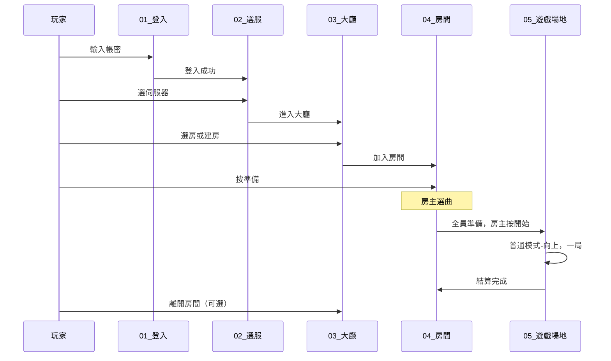

# Flow：登入到遊戲（MVP 主線）

> 優先級：**P0 MVP**
> 這是 MVP 最核心的使用者路徑。

## 目的

玩家從開啟遊戲到打完一局並回到房間的完整流程。

## 主線流程

## 步驟詳細

### Step 1：登入

- **進入條件**：啟動遊戲
- **玩家操作**：輸入帳號、密碼，按登入
- **離開條件**：驗證成功 → 跳轉伺服器選擇
- **失敗**：帳密錯誤 → 顯示錯誤，留在此頁
- **文件**：[screens/01-login/spec.md](../screens/01-login/spec.md)

### Step 2：選伺服器

- **進入條件**：登入成功
- **玩家操作**：選一個伺服器，按確認
- **離開條件**：選服成功 → 進入大廳
- **失敗**：伺服器維護中 → 提示，不可進入
- **文件**：[screens/02-server-select/spec.md](../screens/02-server-select/spec.md)

### Step 3：大廳

- **進入條件**：選服成功
- **玩家操作**：瀏覽房間列表，點房加入或按建立房間
- **離開條件**：成功加入/建立房間 → 進入房間
- **失敗**：房間滿了 / 密碼錯誤 → 提示，留在大廳
- **文件**：[screens/03-lobby/spec.md](../screens/03-lobby/spec.md)

### Step 4：房間

- **進入條件**：加入或建立房間
- **玩家操作**：按準備；房主選曲、按開始
- **離開條件**：全員準備 + 房主按開始 → 進入遊戲場地
- **失敗**：有人未準備 → 無法開始
- **文件**：[screens/04-room/spec.md](../screens/04-room/spec.md)

### Step 5：遊戲場地

- **進入條件**：房間開始遊戲
- **玩家操作**：跟節奏按方向鍵
- **離開條件**：歌曲結束 → 結算 → 自動回房間
- **文件**：[screens/05-game-arena/spec.md](../screens/05-game-arena/spec.md)

### Step 6：回房 / 回大廳（循環）

- 結算後回到房間，可再開一局
- 或按離開 → 回大廳 → 可再選其他房

## 攜帶的狀態

| 階段 | 需要的資料 |
|------|-----------|
| 登入後 | userId, token/session |
| 選服後 | + serverId |
| 進房後 | + roomId, seatIndex, isHost |
| 遊戲中 | + songId, mode, score |
| 結算後 | + finalScores, rank |

## 相關 System

- [account-auth.md](../systems/account-auth.md)
- [room-matchmaking.md](../systems/room-matchmaking.md)
- [scoring-judgment.md](../systems/scoring-judgment.md)
- [networking.md](../systems/networking.md)

## 待確認

- [ ] 結算後自動回房還是手動按「回房」？
- [ ] 房主可以直接從遊戲結束後再開下一局嗎？
