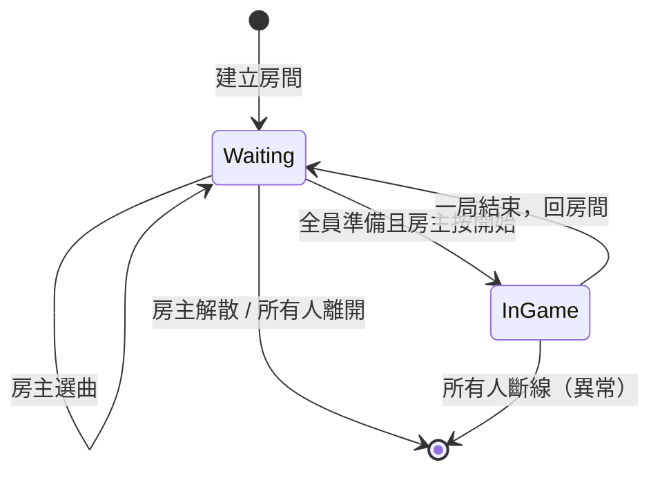

# Flow：房間生命週期

> 優先級：**P0 MVP**

## 目的

描述一個房間從建立到解散的完整狀態變化。

## 房間狀態機

## 狀態說明

### Waiting（等待中）

- 玩家可自由加入（若未滿）
- 玩家可切換準備狀態
- 房主可選曲、踢人、開始
- 非房主可離開

### InGame（遊戲中）

- 不可加入新玩家
- 不可換曲
- 玩家在遊戲場地操作
- 歌曲結束 → 結算 → 回到 Waiting

## 角色權限

| 操作 | 房主 | 一般玩家 |
|------|------|----------|
| 選曲 | ✅ | ❌（待確認） |
| 開始遊戲 | ✅ | ❌ |
| 踢人 | ✅ | ❌ |
| 準備 | ✅ | ✅ |
| 離開房間 | ✅（需指定新房主或解散） | ✅ |
| 解散房間 | ✅ | ❌ |

## 邊界情況

| 情況 | 預期行為 | MVP 策略 |
|------|----------|----------|
| 房主離開 | 轉移房主或解散 | 待確認，MVP 可簡化為解散 |
| 房主未準備就按開始 | 應擋下 | 必須擋 |
| 有人游戏中斷線 | 標記斷線，結算時 0 分 | MVP 做基本處理 |
| 房間空了 | 自動銷毀 | MVP 做 |
| 滿人後有人離開 | 開放名額 | MVP 做 |

## 相關文件

- [screens/04-room/spec.md](../screens/04-room/spec.md)
- [systems/room-matchmaking.md](../systems/room-matchmaking.md)

## 待確認

- [ ] 房主離開時是否自動轉移給下一個玩家？
- [ ] 遊戲進行中有人斷線，其他人繼續還是中止？
