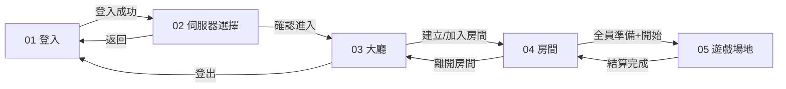
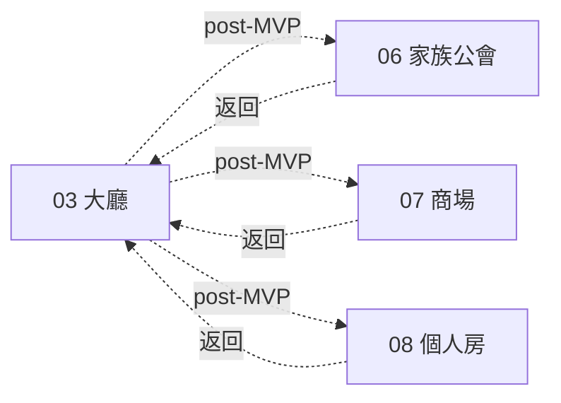

# 導航地圖（Navigation Map）

> Screen 之間的跳轉關係與觸發條件。

## MVP 主線

## post-MVP 分支

## 跳轉條件詳表

| 從 | 到 | 觸發 | 條件 |
|----|----|------|------|
| 01 登入 | 02 選服 | 按「登入」 | 帳密驗證成功 |
| 01 登入 | 01 登入 | 按「登入」 | 帳密錯誤，留頁 |
| 02 選服 | 03 大廳 | 按「確認進入」 | 伺服器非維護中 |
| 02 選服 | 01 登入 | 按「返回登入」 | 無 |
| 03 大廳 | 04 房間 | 點房 / 建立房間 | 房間未滿且 waiting |
| 03 大廳 | 01 登入 | 按「登出」 | 無 |
| 04 房間 | 05 遊戲 | 房主按「開始」 | 全員 ready + 已選曲 |
| 04 房間 | 03 大廳 | 按「離開房間」 | 無 |
| 05 遊戲 | 04 房間 | 結算完成 | 自動或按「回房間」 |
| 03 大廳 | 06 家族 | 按「家族」 | post-MVP |
| 03 大廳 | 07 商場 | 按「商場」 | post-MVP |
| 03 大廳 | 08 個人房 | 按「個人房」 | post-MVP |

## 全局入口

| 入口 | 出現在 | MVP |
|------|--------|-----|
| 登出 | 大廳 | ✅ |
| 設定 | 大廳 / 房間 | P1 → [game-settings.md](../systems/game-settings.md) |
| 返回 | 各子頁 | ✅ |

## 異常跳轉

| 情況 | 跳轉 |
|------|------|
| 斷線 | → 01 登入（顯示提示） |
| 被踢 | → 03 大廳（顯示提示） |
| 房間解散 | → 03 大廳 |
| Token 過期 | → 01 登入 |

## 各 Screen 文件

| Screen | 文件 |
|--------|------|
| 01 登入 | [screens/01-login/spec.md](../screens/01-login/spec.md) |
| 02 選服 | [screens/02-server-select/spec.md](../screens/02-server-select/spec.md) |
| 03 大廳 | [screens/03-lobby/spec.md](../screens/03-lobby/spec.md) |
| 04 房間 | [screens/04-room/spec.md](../screens/04-room/spec.md) |
| 05 遊戲 | [screens/05-game-arena/spec.md](../screens/05-game-arena/spec.md) |
| 06 家族 | [screens/06-guild/spec.md](../screens/06-guild/spec.md) |
| 07 商場 | [screens/07-shop/spec.md](../screens/07-shop/spec.md) |
| 08 個人房 | [screens/08-personal-room/spec.md](../screens/08-personal-room/spec.md) |
