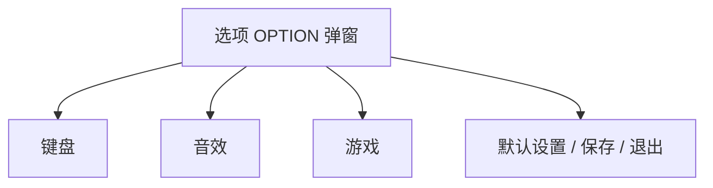

# 客户端設定（Game Settings）

> **原版考據**：超級舞者单机版 v1.0「选项 OPTION」三頁  
> 參考圖（扁平）：[assets/wireframes/](../../assets/wireframes/)  
> **Enhanced** 滾動／譜面時間軸：[scroll-timing.md](../architecture/scroll-timing.md)  
> 文案：[localization.md](localization.md)（文字 i18n，非 bitmap）

---

## 原版 UI 結構



| 分頁 | 參考圖 | 內容摘要 |
|------|--------|----------|
| **音效** | [ref-official-settings-audio.png](../../assets/wireframes/ref-official-settings-audio.png) | 背景音乐 / 游戏音乐 / 游戏音效 — 各一 **MIN～MAX 滑桿** |
| **键盘** | [ref-official-settings-keyboard.png](../../assets/wireframes/ref-official-settings-keyboard.png) | **4 键** / **6 键** 子分頁；4K 主 A S W D、辅 4 5 8 6 |
| | [ref-official-settings-keyboard-6k.png](../../assets/wireframes/ref-official-settings-keyboard-6k.png) | **6 键** 键位 Z X C / 1 2 3 — 见 [§ 6K 布局](#6k-布局原版) |
| **游戏** | [ref-official-settings-game.png](../../assets/wireframes/ref-official-settings-game.png) | 见下表 |

### 游戏分頁（原版）

| 項目 | 選項 |
|------|------|
| 游戏画面 | 全屏 / **窗口**（實質 **800×600**） |
| 全屏泛光效果 | 开启 / 关闭 |
| NOTES面板位置 | 屏幕左边 / 屏幕中央 |
| 游戏特效 | 人物特效 / 场景特效 |
| 游戏视角 | 固定 / 默认 |
| 面板透明度 | MIN～MAX 滑桿 |

### 房間側欄（非 OPTION 內，同屏可見）

| 項目 | 原版 |
|------|------|
| 模式 | 普通模式 等 |
| 歌曲 | RANDOM、难度、**BPM** |
| **SPEED** | 數值（例 **2.5**）± 按鈕 — **跟 BPM 縮放**（小節制譜） |
| 掉落方式 | 向上 / 向下 / … dropdown |

譜面底層：**GN / SM 小節 + BPM**（見 [SM_GN_NOTE_FORMAT.md](../reverse-engineering/SM_GN_NOTE_FORMAT.md)），非 osu 毫秒時間軸。

---

## 原版 vs Enhanced

| 項目 | Classic（貼原版） | Enhanced（改良） |
|------|------------------|------------------|
| 視窗 | 全屏 / 800×600 | **多解析度 + 視窗化 + 縮放** |
| 鍵位 | **仅 4K**；OPTION **隐藏 6 键** 子分页 | **4K + 6K**（6K post-MVP）；完整 keymap |
| 譜面時間 | 小節 + BPM | **毫秒 + SV**（[scroll-timing.md](../architecture/scroll-timing.md)） |
| 流速 | 房間 SPEED × BPM（**Classic 鎖 BPM 制**） | **定速 / 跟 BPM** 可切（osu 同款） |
| 流速開關 | **不暴露**（見 [§ Classic 流速](#classic-流速)） | OPTION 可調 |
| 記住流速 | 隱含 per 房間 | **記住個別圖譜流速** 開關 |
| 判定線 | 原版左/中央面板 | **中央 playfield + osu 式判定線**（见 [§ 判定線](#判定線hit-line)） |
| 音訊 | 三軌音量滑桿 | + **Global offset** |
| 文案 | bitmap 語系圖 | **LocalisableString + resx** |

---

## Enhanced — 視窗（游戏）

| 設定 | 規格 |
|------|------|
| 顯示模式 | 全屏 / 視窗 / **邊框全屏**（post-MVP） |
| 解析度 | 預設列表：800×600、1024×768、1280×720、1280×800、1920×1080… + **自訂寬高** |
| UI 縮放 | 100% / 125% / 150%（高 DPI） |
| 垂直同步 | 開 / 關 |
| VSync 以外 | 沿用原版：泛光、NOTES 位置、特效、視角、面板透明度 → Classic Profile 可保留 |

Phase 1 / Step 1 可鎖 1280×720；設定頁 MVP 起做。

---

Phase 1 / Step 1 可鎖 1280×720；設定頁 MVP 起做。

---

## Classic — 鍵位（键盘）

**已決**：Classic exe **不做 6K 模式**；OPTION 键盘页 **不显示「6 键」子分页**（原版单机虽有，Classic 刻意砍掉）。

| 项目 | Classic |
|------|---------|
| 可玩键数 | **4K only** |
| OPTION UI | 仅 **4 键** 页；`6 键` tab **隐藏** |
| 房間/模式 | 不可选六键、反键等（post-MVP 模式表亦不含 6K） |
| 默认键 | A S W D + 辅 4 5 8 6（同 [4K 预设](#enhanced--鍵位键盘)） |
| `bindings.json` | 只存 4 lane；无 6K 字段 |

Enhanced 才显示 **4 键 / 6 键** 切换与 [6K 布局](#6k-布局enhanced-only)。

---

## Enhanced — 鍵位（键盘）

對標原版 **主键位 + 辅助键位**，擴充為完整 keymap：

| 能力 | 規格 |
|------|------|
| 模式 | **4K**（Step 1）；**6K** / 8K post-MVP（**仅 Enhanced**） |
| 每 lane | **Primary + Secondary**（原版 ↔ 主/辅） |
| 額外 | Space、Esc、重玩、截圖… 可綁 |
| 交互 | 點列 → 聽候按鍵；**衝突檢查**；一鍵恢復預設 |
| 儲存 | `%LocalAppData%/Remake/bindings.json`；Classic / Enhanced 各存或共用（待決，預設 **共用**） |

預設 4K（與原版主键位對齊）：

| Lane | Primary | Secondary（原版辅） |
|------|---------|---------------------|
| ← | A | 4 |
| ↓ | S | 5 |
| ↑ | W | 8 |
| → | D | 6 |

### 6K 布局（Enhanced only）

> 考據（原版官方）：[ref-official-settings-keyboard-6k.png](../../assets/wireframes/ref-official-settings-keyboard-6k.png)  
> **Classic 不实现、OPTION 隐藏 6 键页。**

**6 键模式键位设置** — 六 lane，含 **斜向**（↖ ↗）：

| Lane | 默认键 | 方向 | 备注 |
|------|--------|------|------|
| 0 | **Z** | ← 左 | 左组 |
| 1 | **X** | ↖ 左上（斜） | 左组 |
| 2 | **C** | ↓ 下 | 左组 |
| 3 | **1** | ↑ 上 | 右组 |
| 4 | **2** | ↗ 右上（斜） | 右组 |
| 5 | **3** | → 右 | 右组 |

- 交互同 4K：点键框 → 输入热键；可单手/双手
- **Enhanced** post-MVP：OPTION 显示 **6 键** 子分页；lane 0–5 各 Primary + Secondary
- Step 1：不做 6K

---

## 判定線（Hit line）

> **Enhanced** 学 **osu!mania**：音符朝 **固定水平判定線** scroll，在線上判 timing（非贴屏幕底硬编码）。

| 项目 | Classic | Enhanced |
|------|---------|----------|
| NOTES 面板 | 原版 **屏幕左边** 默认；可设 **屏幕中央**（OPTION） | 默认 **playfield 屏幕中央** |
| 判定線 Y | 跟原版面板（左/中） | **playfield 垂直中央**（`hit_position_ratio = 0.5`） |
| 机制 | scroll 向判定線；BPM×SPEED | 同 osu：notes → hit line；[scroll-timing.md](../architecture/scroll-timing.md) |
| 可调 | 原版透明度等 | `hit_position_ratio` 0.35–0.65（OPTION 游戏，post-MVP） |

osu 参考：HitPosition 概念（notes 在 playfield 内 scroll 至判定线）；Enhanced 默认 **中央判定** 而非 osu 默认贴底，但 **timing 算法同 osu mania**（到线时刻 = `HitObject.time`）。

Step 1（4K 向上）：判定線固定 playfield 中央一条线即可。

---

## Enhanced — 音效

| 設定 | 原版 | Enhanced |
|------|------|----------|
| 背景音乐 | 滑桿 | 同 + mute |
| 游戏音乐 | 滑桿 | 同 |
| 游戏音效 | 滑桿 | 同 |
| **Global offset** | 無 | **± ms 滑桿/數字框**（對標 osu *Universal offset*） |
| 套用 | — | 即時預覽 metronome（Phase 1+） |

`globalOffsetMs` 寫入使用者設定；**不寫進譜面**。  
譜面作者 offset 在 `.osu` `AudioLeadIn` / `-12345` ms — Ruleset：`effectiveTime = chartTime + userGlobalOffset`。

---

## Enhanced — 流速（Gameplay / 房間）

對標 **osu!mania**（[osu-wiki mania](https://github.com/ppy/osu-wiki/blob/master/wiki/Game_mode/osu!mania/en.md)）：

| 設定 key | osu 名稱 | 預設（Enhanced） | 說明 |
|----------|----------|------------------|------|
| `scale_scroll_with_bpm` | Scale osu!mania scroll speed with BPM | **關** | 關 = **定速**；開 = 同 scroll 數字下 BPM 越高越快 |
| `remember_scroll_per_beatmap` | Remember osu!mania scroll speed per beatmap | **關** | 開 = 每譜記憶上次 Ctrl+± 調的速度 |
| `scroll_speed` | 房間 SPEED / F3 F4 | 使用者全域 | 定速模式下跨 BPM 體感一致 |

**房間側欄**（Enhanced）：保留「掉落方式」；**SPEED** 改綁 `scroll_speed`（語意同 osu fixed scale）。

**譜面內 SV（綠線）**：Enhanced 读 `.osu` SV；Classic 不暴露 SV 相关选项（见下）。

---

## Classic — 流速

**已決**：Classic exe **永远 BPM 制**，等同 osu 开启 *Scale osu!mania scroll speed with BPM* — **OPTION 不显示此开关**。

| 项目 | Classic |
|------|---------|
| `scale_scroll_with_bpm` | **强制 true**（代码写死，无 UI） |
| `remember_scroll_per_beatmap` | **不暴露**（无 per-map 记忆 UI） |
| 定速 scroll | **不提供** |
| 房間 **SPEED** | 保留（侧栏 2.5 ±），语义 = `scroll_speed` × 当前 BPM |
| SV 绿线 | 不暴露；滚动仅 BPM×SPEED 体感（GN 谱 import 后仍 BPM 缩放） |

Enhanced OPTION 里的流速开关 **Classic Profile 不出现**。

---

## 設定儲存與同步

**原則**：**本地為準** → 有勾選的項目才 **上傳 Steam Cloud**；換機登入同一 Steam 帳號可拉回。

### 本地（永遠寫入）

```
{LocalAppData}/Remake/
├── settings.json              # 視窗、音量、offset、scroll、sync 勾選狀態
├── bindings.json              # keymap
└── beatmaps/
    └── {chartHash}.json       # remember_scroll_per_beatmap 時 per-map scroll
```

### Steam Cloud（MVP+，可選）

| 項目 | 預設同步 | 說明 |
|------|----------|------|
| `sync_to_steam` | **關** | 總開關；關 = 僅本地 |
| 鍵位 `bindings.json` | 使用者勾選 | 換電腦恢復 ASDW / 4568 |
| 音效音量 | 使用者勾選 | 三軌 slider |
| **global_offset_ms** | 使用者勾選 | 音效頁 |
| **scroll_speed** | 使用者勾選 | 全域流速 |
| **scale_scroll_with_bpm** | 使用者勾選 | 定速 / 跟 BPM |
| **remember_scroll_per_beatmap** | 使用者勾選 | 開關本身 |
| **per_map_scroll** 表 | 隨上項 | `beatmaps/*.json` 合併進 cloud blob |
| 視窗解析度 / 全屏 | 使用者勾選 | 換機常要 |
| 語系 `culture` | 使用者勾選 | 與 [localization.md](localization.md) 連動 |

**不同步**（僅本地或根本不存）：單局房間暫存、除錯 flag、本機路徑。

### 設定 UI（OPTION 或獨立「同步」區）

```
[ ] 將設定同步到 Steam 云（需 Steam 登入）

  勾選要同步的項目：
  [ ] 鍵位  [ ] 音量  [ ] Global offset
  [ ] 流速與 BPM 選項  [ ] 各圖譜流速記憶
  [ ] 視窗與解析度  [ ] 語系
```

可做成 **總開關 + 全選/全不選**；各子項只有總開關 ON 時可勾。

### 技術（Facepunch Steamworks）

- API：**Steam Remote Storage**（Steam Cloud）
- Cloud 檔名：`Remake/user_settings_v1.json`（合併可同步欄位 + schema version）
- 流程：本地 `settings.json` 變更 → debounce → 若該欄位 `sync_*` 為 true → 序列化 subset → `RemoteStorage.FileWrite`
- 啟動 / Steam 登入：`FileRead` → 與本地 merge（**較新 `updatedAt` 贏**；同 timestamp 本地優先）
- Classic / Enhanced：**各 AppId 独立 cloud 檔**（兩 exe 不共用同一 blob，除非日後統一 AppId）

Phase 1 / Step 1：**僅本地**，無 Steam。

詳見 [online-services.md](../architecture/online-services.md#steam-cloud-設定同步)。

---

## 階段

| 階段 | 設定 |
|------|------|
| Step 1 | 硬編碼鍵位；無設定 UI |
| Phase 1 | Global offset + scroll_speed（定速預設）；簡化選項 |
| MVP | 完整三頁 OPTION + 多解析度 + keymap UI + **Steam 設定同步（可選）** |
| Classic exe | 原版 OPTION 子集 + 800×600；**无流速模式开关** |

---

## 已決（原待填）

- [x] **6K 布局** — 原版考据 Z X C / 1 2 3；**仅 Enhanced**；Classic **隐藏 6 键 OPTION**
- [x] **判定線** — Enhanced：中央 playfield + osu mania 式 scroll-to-line；Classic：原版左/中面板
- [x] **Classic 流速** — 锁 BPM 制（`scale_scroll_with_bpm = true`），不暴露定速/per-map 开关

## 相關

- [scroll-timing.md](../architecture/scroll-timing.md)
- [localization.md](localization.md)
- [screens/03-lobby/spec.md](../screens/03-lobby/spec.md) — 大廳「設定」入口
