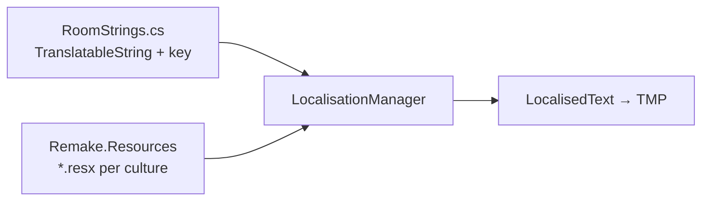

# 多語系（Localization）

> **原版 SDO**：UI 文案 = **各語言圖片**  
> **重製**：對齊 **[osu! lazer](https://github.com/ppy/osu/wiki/Localising-the-client)** — `LocalisableString` + `.resx` + `*Strings.cs`  
> 參考：[osu-framework Localisation](https://github.com/ppy/osu-framework/wiki/Localisation) · [osu-resources](https://github.com/ppy/osu-resources/tree/master/osu.Game.Resources/Localisation)

父文件：[copy-tone.md](../shared/copy-tone.md) · [ui-patterns.md](../shared/ui-patterns.md)

---

## 原版 vs 重製

| | 原版 SDO | 重製（osu 方式） |
|---|---------|-----------------|
| UI 文案 | 每語言一套 bitmap | **TMP** + `LocalisableString` |
| 字串型別 | `string` / 圖 | UI 綁 **`LocalisableString`**，不用裸 `string` |
| 翻譯檔 | 無（換圖） | **`.resx`** per culture（類 osu-resources） |
| 程式入口 | — | `RoomStrings.CreateRoom` → `TranslatableString(key, fallback)` |
| 判定字 | 圖 / 固定英文 | **`JudgmentResult` enum** + `LocalisableDescription` |
| 分數數字 | 數字圖集 | `score.ToLocalisableString("N0")` |
| 翻譯流程 | — | 英文 fallback 進 code → export `.resx` → Crowdin（post-MVP） |

**不做** bitmap 語系 UI。裝飾圖、skin、音符仍用 Asset。

---

## osu 怎麼做（對照表）

| osu 元件 | 本專案 |
|----------|--------|
| `LocalisableString` | `Remake.Localisation` — 從 osu-framework **移植概念**（Unity 不嵌 framework） |
| `TranslatableString(key, fallbackEn)` | 同左 |
| `LocalisableString.Format` / `Interpolate` | 同左；`"{0} G"` 占位 |
| `ToLocalisableString("N0")` | 分數、Combo、百分比 |
| `GeneralSettingsStrings.cs` 等 | `RoomStrings.cs`、`ResultStrings.cs`… |
| `osu.Game.Resources.Localisation/*.resx` | `Remake.Resources/Localisation/*.resx` |
| `LocalisationManager` + `ILocalisationStore` | 同左；culture 變更 → UI 刷新 |
| `[LocalisableDescription]` on enum | `JudgmentResult` → `JudgmentStrings` |
| `GetLocalisableDescription()` | Ruleset 顯示判定名 |
| Crowdin + localisation-analyser | post-MVP；結構先相容 `.resx` export |

---

## 架構



### Repo 切塊

```
src/
├── Remake.Localisation/           # LocalisableString、Manager、Store（osu-framework 簡化 port）
├── Remake.Resources/              # 僅 .resx + 嵌入資源（對標 osu-resources）
│   └── Localisation/
│       ├── RoomStrings.resx       # en 預設 / 模板
│       ├── RoomStrings.zh-TW.resx
│       └── JudgmentStrings.resx
└── Remake.Unity.Enhanced/
    └── LocalisedText.cs           # TMP 綁 LocalisableString，訂閱 culture 變更
```

程式碼 **不直接寫**「登入」「確定」字面；只引用 `RoomStrings.Login` 等 static 屬性。

---

## 程式模式（對標 osu）

### 1. `*Strings.cs` + key prefix

```csharp
// Remake.Game/Localisation/RoomStrings.cs（對標 GeneralSettingsStrings.cs）
public static class RoomStrings
{
    private const string prefix = "Remake.Resources.Localisation.RoomStrings";

    /// <summary>"Create room"</summary>
    public static LocalisableString CreateRoom =>
        new TranslatableString($"{prefix}:create_room", "Create room");

    private static string getKey(string key) => $"{prefix}:{key}";
}
```

### 2. `.resx` 翻譯

```xml
<!-- RoomStrings.zh-TW.resx -->
<data name="create_room" xml:space="preserve">
  <value>建立房間</value>
</data>
```

Key 規則與 osu 相同：`{prefix}:{snake_case}`。

### 3. UI 綁定

```csharp
// osu: Drawable 的 Text = LocalisableString
// Unity: LocalisedText 元件
localisedText.Text = RoomStrings.CreateRoom;
```

**禁止** UI 層 `text.text = "建立房間"`。  
**禁止** `.ToString()` 取翻譯做邏輯（osu 同規 — 會 fallback 英文）。

### 4. 插值

```csharp
// osu: LocalisableString.Format / TranslatableString 帶參
ResultStrings.TotalReward.Format(gAmount.ToLocalisableString("N0"));
```

`.resx`：`總計 {0} G`（繁中語序可與英文不同）。

### 5. 判定 enum（對標 HitResult）

```csharp
public enum JudgmentResult { Perfect, Cool, Bad, Miss }

public static class JudgmentStrings
{
    public static LocalisableString Perfect => new TranslatableString(..., "Perfect");
    // ...
}

// enum 成員
[LocalisableDescription(typeof(JudgmentStrings), nameof(JudgmentStrings.Perfect))]
Perfect,

// 顯示
judgment.GetLocalisableDescription();  // → 依當前 culture 解 resx
```

SDO 判定 **維持英文 key fallback**（Perfect/Cool/Bad/Miss），各 locale 的 `.resx` 決定顯示英文或繁中（與 osu Great/Perfect 相同模式）。  
不再「全局二選一」— **per locale 翻譯表決定**。

### 6. Culture 切換

- `LocalisationManager.CurrentCulture` bindable（osu 同）
- 設定頁「語言」→ 換 culture → 所有 `LocalisedText` 自動刷新
- 開發用：**Debug (show raw keys)** 顯示 `[prefix:key]`（osu 除錯方式）

---

## 渲染

| 項目 | 選型 |
|------|------|
| 文字 | **TextMeshPro** |
| 字型 | Noto Sans TC + 拉丁；**一套字型** cover 多語系 |
| 數字 | `ToLocalisableString` + TMP，**不用數字圖** |

---

## 階段

| 階段 | 做法 |
|------|------|
| **Step 1** | 可先 `JudgmentStrings` + `LocalisedText` 最小閉環；判定走 enum + `LocalisableString` |
| **Phase 1** | 選歌/結算 `*Strings.cs` + `zh-TW.resx` |
| **MVP** | 設定語言；`en` + `zh-TW` 兩套 resx |
| **post-MVP** | Crowdin 流程（可選 [osu-localisation-analyser](https://github.com/ppy/osu-localisation-analyser) 同模式 export） |

Classic / Enhanced **共用** `Remake.Resources`；exe 差異文案用不同 `*Strings` 類或 key 前綴，不拆圖。

---

## 禁止

- bitmap 語系按鈕 / 欄位標題
- UI 可見處裸 `string`（新 code）
- 用 `.ToString()` 當玩家語系顯示
- JSON 自研格式 **取代** resx（除非僅 Step 1 暫存，Phase 1 前 migrate 到 osu 同款 resx）

---

## 待填

- [ ] `Remake.Localisation` 從 osu-framework 拷哪些檔 vs 自寫最小子集
- [ ] 預設 culture：跟 OS 還是鎖 `zh-TW`（osu 跟使用者選的 language）

## 相關

- [copy-tone.md](../shared/copy-tone.md)
- [external-references.md](../reference/external-references.md)
- [architecture/repo-structure.md](../architecture/repo-structure.md)
- [architecture/dual-variant.md](../architecture/dual-variant.md)
