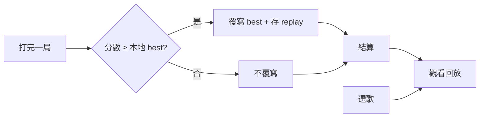

# 本地回放（Local Replay）

> **Enhanced 專用** — [dual-variant.md](../architecture/dual-variant.md)  
> 參考：[osu! replay](https://github.com/ppy/osu/tree/master/osu.Game/Replays)
> 適用：**自由模式**（原版不記 personal best；新版本地記錄 + 回放）  
> 父文件：[free-mode.md](../screens/05-game-arena/modes/free-mode.md)

## 原版 vs 新版

| | 原版自由模式 | 新版自由模式 |
|---|-------------|-------------|
| Personal best | 不記錄 | **本地**記錄（分數、準確度、日期） |
| 回放 | 無 | **本地 `.rpl`**，可重看按鍵與舞蹈 |
| 上傳 / 排行榜 | — | 不做（勝負仍不記 PlayFab） |

普通模式 post-MVP 是否共用同一格式 → 待決；P1 先做自由模式。

---

## 玩家流程



| 入口 | 行為 |
|------|------|
| 結算 | 「觀看回放」播本局；若已存為 best 則播 best |
| 選歌 | 有 best 時顯示分數 + 「觀看最佳回放」 |

Phase 1 **不做**；**P1**（自由模式 + 本地存檔就緒後）。

---

## Replay 檔案（`.rpl`）

與 osu 類似：**不存影片**，存 **譜面 identity + 按鍵 frame 序列**；播放時 Ruleset 重算判定，分數應與原局一致（同版本 deterministic）。

### Header

| 欄位 | 說明 |
|------|------|
| `formatVersion` | replay 格式版 |
| `chartHash` | Canonical Chart 內容 hash |
| `songId` | 歌曲 id |
| `difficultySlot` | Easy / Normal / Hard |
| `scrollDirection` | up / down / tilt |
| `rulesetVersion` | 判定邏輯版（改版後舊 replay 可能失效） |
| `score` | 總分 |
| `accuracy` | 準確度 |
| `maxCombo` | 最大 combo |
| `counts` | P / C / B / M |
| `playedAt` | UTC timestamp |
| `playerName` | 本地顯示名（可空） |

### Frame 序列

每 frame（或 osu 式 **非均勻** delta 編碼）：

| 欄位 | 說明 |
|------|------|
| `timeMs` | 相對歌曲開始的毫秒 |
| `keys` | 4K bitmask：↑ ↓ ← →（hold 用 press / release 事件） |

Tap = 單次 press；Hold = press + release 兩事件。  
編碼細節實作時對齊 osu `ReplayFrame`（mania 8K 可簡化為 4 bit）。

### 舞蹈

| 層 | 回放方式 |
|----|----------|
| **譜面 VMD** | 跟 `timeMs` 播 chart 綁定的 base 舞蹈（同局相同） |
| **判定驅動反應** | 由重跑判定事件觸發（Perfect/Cool…），不另存 pose |
| **鏡頭** | VMD camera track 跟時間軸；P1 可選 director 覆寫 |

不需存每幀骨骼；**輸入 + chart + ruleset** 足以還原按鍵與舞蹈（與 osu 同一思路）。  
若日後有非 deterministic 特效，再評估 sidecar snapshot。

---

## 本地儲存

```
{UserLocalAppData}/Remake/
├── scores.json              # best 索引：songId + slot → score, replayPath, playedAt
└── replays/
    └── {songId}_{slot}_{chartHashShort}.rpl
```

- 每 **song + 難度 slot** 保留 **1 份 best replay**（覆寫）
- 可選設定：保留最近 N 局非 best（P2）

---

## 播放模式

| 模式 | UI | 說明 |
|------|-----|------|
| **Full** | 音符 + 角色 + 判定線 | 一般觀看 |
| **Spectator** | 同上 + 幽靈按鍵 overlay | 顯示 replay 按鍵（osu 風） |

播放時：

1. 載入 chart + replay header 校驗 hash
2. `rulesetVersion` 不符 → 提示「判定已更新，回放可能不一致」
3. 音訊 seek 到 0；按 frame 餵入 `keys`
4. Dance 模組跟 `CurrentTime` 播 VMD + 判定事件

---

## 程式切塊（P1）

```
src/
├── Remake.Replay/           # .rpl 讀寫、encode/decode
└── Remake.Unity/
    └── Assets/Scripts/
        ├── ReplayRecorder.cs    # 遊玩時錄 frame
        └── ReplayPlayer.cs      # 播放 + 餵 Ruleset
```

依賴：`Remake.Ruleset`（deterministic）、`Remake.Dance`（VMD 就緒後）。

---

## Phase 對照

| 階段 | 回放 |
|------|------|
| Phase 1 | 不做（見 [PHASE1.md](../PHASE1.md)） |
| P1 | 自由模式本地 best + `.rpl` + 觀看（需 VMD 或 placeholder 舞蹈軌） |
| MVP+ | 選歌 best 顯示、結算「觀看回放」 |
| P2+ | 多 replay 槽、匯出分享（非 scope） |

---

## 待填

- [ ] frame 編碼：固定 tick vs osu delta（實作時 benchmark）
- [ ] `rulesetVersion` bump 策略與舊檔相容
- [ ] 無 VMD 時 placeholder 是否仍存 replay（僅音符）

## 相關

- [free-mode.md](../screens/05-game-arena/modes/free-mode.md)
- [dance-vmd.md](../architecture/dance-vmd.md)
- [scoring-hybrid.md](../architecture/scoring-hybrid.md)
- [result-screen.md](../screens/05-game-arena/result-screen.md)
